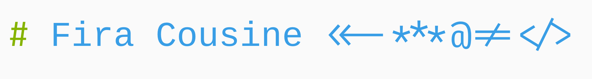
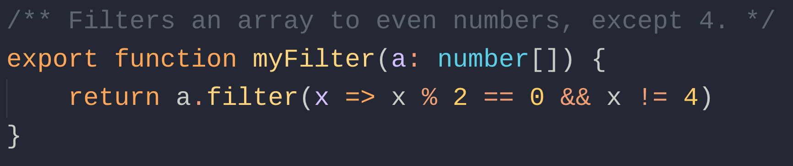
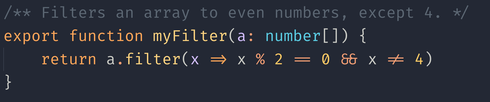
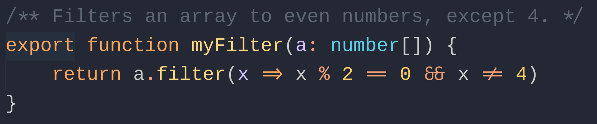

# Fira Cousine <<-***@!=</>

**Fira Cousine** is [Cousine](https://fonts.google.com/specimen/Cousine) font enhanced with [Fira Code](https://github.com/tonsky/FiraCode)'s punctuation marks and ligatures. I created this because I like ligatures but find Fira Code hard to read, compared to my favourite font Cousine.

This is what regular Cousine looks like:

Legible but no ligatures. Here's what Fira Code looks like.

Beautiful ligatures and punctuation marks but the font is overly curly and harder to read.
**Enter, Fira Cousine:**

Why choose between legibility and ligatures? Have both!

**I do not own the copyright to either font nor have I created the tools to create this font. Credits go to:**
 - @tonsky for creating [FiraCode](https://github.com/tonsky/FiraCode) font
 - @ToxifFrog for [Ligaturizer](https://github.com/ToxicFrog/Ligaturizer) tool for adding ligatures to other fonts

## How to use

1. Download the .ttf files and install them.
1. Set up your editors, terminals, etc... Name of the font is `Liga Fira Cousine`